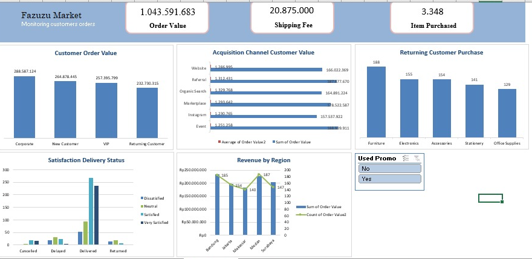

# Excel_Customer_Orders_Analysis

## Project Overview
This project analyzes customer orders to understand customer segment, shopping behavior, level of satisfaction, and customer loyality.

## Business Objective
The objective is to evaluate quality of data, identify customer the strongest revenue drivers, conducting order analysis, operasional and satisfaction analysis based on Excel analysis.

## Dataset
The dataset contains order value, customer segment, acquisition channel, items purchased, delivery status, and satisfaction.     

## Tools Used
- Microsoft Excel
- Excel formulas
- PivotTable or summary anaysis
- Excel dashboard
- GitHub documentation

## Analysis Process
1. Reviewed the raw dataset
2. Cleaned incosistent or incomplete data
3. Created calculated fields and summary analysis
4. Built charts and dashboard views
5. Wrote business insights and recommendations

## Dashboard Preview

## Project Files
- [dataset-2-customer-orders.xlsx](dataset-2-customer-orders.xlsx): source dataset
- [analysis-2-customer-orders.xlsx](analysis-2-customer-orders.xlsx): Excel analysis workbook
- [dashboard-preview.png]: dashboard screenshoot
- [business-insights.md]: key findings and recommendations

## Key Insights
- Corporate is highest customer order value in Fazuzu Market
- The highest volume of item sales came from the event
- Medan is the highest revenue region with 187 orders and revenue Rp226.166.795

## Recommendations
- Conduct audits of logistics partners to reduce the rates of delayed and returned shipments, which can lower customer satisfaction
- Make a bundling office supplies and furniture for corporate to increase revenue. 
